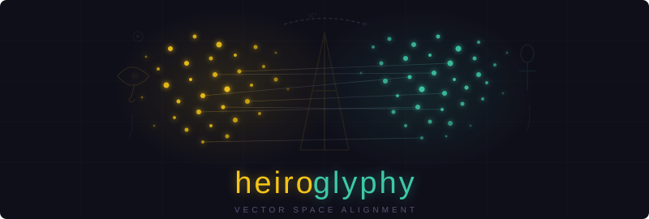

<p align="center">
  
</p>

# Heiroglyphy

**Ancient Egyptian has been translated by scholars for centuries — but translation is lossy.** Nuance, connotation, and the web of relationships between words get compressed into a single modern equivalent. The word *nṯr* becomes "god," but its proximity to *nsw* (king), *ḥtp* (offering), and *mꜣꜥ.t* (truth/order) — the semantic neighborhood that defined what divinity *meant* to an Egyptian speaker — is lost.

**Word embeddings preserve that geometry.** Every word lives in a high-dimensional space where distance encodes meaning. Words that appear in similar contexts cluster together — not by definition, but by *usage*. If we can train embeddings on Ancient Egyptian texts and align that space to English, we don't just get translations. We recover the *structure of meaning* that literal translation left behind.

**That is what this project attempts.** Across 15 experimental iterations, from failed neural networks to elegant linear algebra, we built a system that aligns 80,662 Egyptian word vectors to English — achieving **32.35% Top-1 accuracy** on unsupervised cross-lingual alignment across a 4,000-year language gap.

> **Read the full paper:** [Recovering the Conceptual Geometry of Ancient Egyptian Through Vector Space Alignment (PDF)](docs/paper/heiroglyphy.pdf)

## 🧬 The Vec2Vec Hypothesis

The core challenge is to find a transformation $f$ such that:

$$ f(v_{hieroglyph}) \approx v_{english} $$

Every language, when embedded, forms a geometric shape. The **Distributional Hypothesis** tells us that similar shapes emerge across languages — words for "water" cluster near words for "river" whether in Egyptian or English. The vec2vec approach exploits this: find the rotation that best overlays one shape onto the other.

*   **Attempts 1 & 2** explored **Neural Vec2Vec**: Deep networks to learn non-linear mappings between spaces. Both failed.
*   **Attempts 3-12** explored **Linear Alignment (Procrustes/Ridge)**: Analytic solutions that consistently outperformed neural approaches.

## 📊 Progress Summary

| Attempt | Technique | Top-1 Accuracy | Status |
|---------|-----------|----------------|--------|
| V1 | Neural Vec2Vec (Multi-Space) | - | ❌ Failed (instability) |
| V2 | Unsupervised Neural Vec2Vec | - | ❌ Failed (isomorphism gap) |
| V3 | Linear Procrustes + Anchors | 22.0% | ✅ Baseline |
| V4 | Linear + CSLS | 15.0% | ⚠️ Negative result |
| V5 | Linear + 10x Data | 24.53% | ✅ Scaled baseline |
| V6 | BERT Contextual | 0.47% | ❌ Failed (tokenization) |
| V7 | FastText 768d | 29.10% | ✅ Text-only breakthrough |
| V8 | Coptic Bridge | 28.16% | ⚠️ Negative result |
| V9 | Visual Features (1536d) | 30.52% | ✅ First 30%+ |
| V10 | Vocab Normalization | 30.67% | ✅ Previous SOTA |
| V11 | MLP + N-grams | 28.76% | ⚠️ Regression |
| V12 | Egyptian→German | 12.90% | 🧪 Exploratory |
| V13 | Alpha Tuning + Ablation | 31.57% | ✅ Previous SOTA |
| V14 | Iterative Procrustes + Hub Filter | 31.57% | ⚠️ No improvement |
| V15 | FastText Retraining (mc5_w10) | **32.35%** | ✅ **Current SOTA** 🎉 |

**Key Insight**: Simple linear methods with good data outperform complex neural architectures for low-resource ancient language alignment. Retrieval accuracy and regression loss are anti-correlated — optimize for retrieval directly.

## 📂 Project Structure

### [Attempt 1: The Translation Bridge (`heiro_v1`)](./heiro_v1)
*   **Technique**: **Neural Vec2Vec (Multi-Space)**.
*   **Strategy**: Bridging Hieroglyphic and English spaces using German as a pivot.
*   **Outcome**: Complexity of aligning three spaces with neural networks led to instability.

### [Attempt 2: The Purist Geometric Mapping (`heiro_v2`)](./heiro_v2)
*   **Technique**: **Unsupervised Neural Vec2Vec**.
*   **Strategy**: Adversarial alignment based purely on geometric density, zero supervision.
*   **Outcome**: Failed due to the "Isomorphism Gap" - Ancient Egyptian is too different from Modern English.

### [Attempt 3: Anchor-Guided Alignment (`heiro_v3`)](./heiro_v3)
*   **Technique**: **Linear Vec2Vec (Orthogonal Procrustes)**.
*   **Strategy**: ~1,300 anchor points with analytic linear rotation.
*   **Outcome**: **22% accuracy** - First successful alignment, proving linear methods work.

### [Attempt 4: CSLS Refinement (`heiro_v4`)](./heiro_v4)
*   **Technique**: **Linear Vec2Vec + CSLS**.
*   **Strategy**: Cross-Domain Similarity Local Scaling to reduce hubness.
*   **Outcome**: **15% accuracy** ⚠️ - CSLS too aggressive for sparse datasets.

### [Attempt 5: Scaled Corpus Alignment (`heiro_v5_getdata`)](./heiro_v5_getdata)
*   **Technique**: **Procrustes + 10x Data**.
*   **Strategy**: Combined corpus of 104,000 texts, 8,541 anchor pairs from TLA, Ramses, BBAW.
*   **Outcome**: **24.53% accuracy** - 11.5% relative improvement. Perfect hits on deities (Osiris: 61.5%, Horus: 62.1%).

### [Attempt 6: BERT Contextual Embeddings (`heiro_v6_BERT`)](./heiro_v6_BERT)
*   **Technique**: **BERT Contextual Embeddings**.
*   **Strategy**: Context-aware representations for polysemy.
*   **Outcome**: **0.47% accuracy** ❌ - WordPiece tokenizer destroyed hieroglyphic transliteration.

### [Attempt 7: FastText 768d (`heiro_v7_FastTextVisual`)](./heiro_v7_FastTextVisual)
*   **Technique**: **Large-Scale FastText (768d)**.
*   **Strategy**: 2.56x larger embeddings + Ridge regression alignment.
*   **Outcome**: **29.10% accuracy** ✅ - 18.6% relative improvement over V5.

### [Attempt 8: Coptic Bridge (`heiro_v8_use_coptic`)](./heiro_v8_use_coptic)
*   **Technique**: **Coptic Bridge Alignment**.
*   **Strategy**: Using Coptic cognates to expand anchors (+368 pairs).
*   **Outcome**: **28.16% accuracy** ⚠️ - Etymology ≠ Semantics. Quality > Quantity for anchors.

### [Attempt 9: Visual Features Redux (`heiro_v9_use_visuals_again`)](./heiro_v9_use_visuals_again)
*   **Technique**: **Text + Visual Fusion (1536d)**.
*   **Strategy**: ResNet-50 visual features from HamdiJr hieroglyph images fused with FastText.
*   **Outcome**: **30.52% accuracy** ✅ - First model to break 30%! Visual match rate was 0%, but larger dimensionality helped.

### [Attempt 10: Vocabulary Refinement (`heiro_v10_refinement`)](./heiro_v10_refinement)
*   **Technique**: **Vocabulary Normalization + Lexicon Integration**.
*   **Strategy**: Cleaned vocabulary, integrated HamdiJr lexicon, normalized transliteration variants.
*   **Outcome**: **30.67% accuracy** ✅ - Minor gains from data cleaning.

### [Attempt 11: MLP Training (`heiro_v11`)](./heiro_v11)
*   **Technique**: **MLP + N-gram Features**.
*   **Strategy**: Neural approach with cleaner data pipeline.
*   **Outcome**: **28.76% accuracy** ⚠️ - Confirms linear methods beat neural for this task.

### [Attempt 12: Egyptian→German (`heiro_v12`)](./heiro_v12)
*   **Technique**: **Procrustes with German Target**.
*   **Strategy**: Minimal 80-anchor alignment directly to German (original translation language).
*   **Outcome**: **12.90% accuracy** 🧪 - Exploratory work, not SOTA attempt.

### [Attempt 13: Alpha Tuning + Ablation (`heiro_v13`)](./heiro_v13)
*   **Technique**: **Ridge Alpha Cross-Validation + CSLS + 768d Ablation**.
*   **Strategy**: Systematic hyperparameter sweep. Discovered MSE is anti-correlated with retrieval accuracy.
*   **Outcome**: **31.57% accuracy** ✅ - Alpha=0.1 beats V10's alpha=1.0. CSLS definitively harmful.

### [Attempt 14: Iterative Procrustes + Hub Filtering (`heiro_v14`)](./heiro_v14)
*   **Technique**: **MNN Bootstrapping + Stopword Filtering**.
*   **Strategy**: Bootstrap new anchors via mutual nearest neighbors; filter function words from alignment.
*   **Outcome**: **31.57% accuracy** ⚠️ - No improvement. Revealed 60% of test set is function words.

### [Attempt 15: FastText Retraining (`heiro_v15`)](./heiro_v15)
*   **Technique**: **FastText Parameter Sweep (min_count, window, epochs)**.
*   **Strategy**: Filtered 87% of vocabulary as noise (hapax legomena), widened context window.
*   **Outcome**: **32.35% accuracy** ✅ - **Current SOTA**. Cleaner embeddings + alpha=0.001.

---

### [Final Output (`final_output`)](./final_output)

Production-ready Egyptian word vectors aligned to GloVe 300d space:

| File | Size | Description |
|------|------|-------------|
| `egyptian_aligned_vectors.npz` | 43 MB | 80,662 Egyptian words (float16 compressed) |
| `egyptian_aligned_vocab.pkl` | 1.5 MB | Word → vector index mapping |
| `egyptian_lookup.py` | 9 KB | Full lookup utility (requires gensim) |
| `egyptian_lookup_lite.py` | 6 KB | Lightweight version (numpy only, for edge/mobile) |
| `concept_vectors.npz` | 157 KB | 279 pre-computed concept vectors (18 categories) |
| `concept_categories.json` | 4 KB | Category metadata (elements, deities, royalty, etc.) |
| `hieroglyph_dictionary.tsv` | 720 KB | 11,727 entries: hieroglyph → transliteration → English |
| `hieroglyph_dictionary.json` | 2 MB | Same data in JSON for programmatic access |
| `EgyptianHiero.ttf` | 2.7 MB | Hieroglyphic font (EgyptianHiero 4.03) |
| `esoteric_glove_vectors.npz` | 62 KB | Legacy 113-concept vectors (superseded by concept_vectors) |
| `metadata.json` | 432 B | V10 SOTA methodology and evaluation metrics |

**Quick Usage:**
```python
from egyptian_lookup import EgyptianLookup

lookup = EgyptianLookup(
    vectors_path="egyptian_aligned_vectors.npz",
    vocab_path="egyptian_aligned_vocab.pkl",
    glove=glove  # any GloVe 300d model
)

# Find Egyptian words for English concepts
lookup.find("sun")  # [('ḥrw-nbw', 0.40), ('ḥrw', 0.39), ...]
lookup.find_relationship(["death", "rebirth"])  # semantic combinations
lookup.find_blend({"power": 0.7, "wisdom": 0.3})  # weighted blends
```

## 🚀 Getting Started

**For using pre-trained vectors**, start with **`final_output`** — production-ready files and lookup utilities.

**For the SOTA methodology**, see **`heiro_v15`** (32.35%) — retrained FastText with optimized parameters.

**For understanding the baseline**, **`heiro_v7_FastTextVisual`** documents the original 768d FastText approach (29.10%).

**For the data pipeline**, **`heiro_v5_getdata`** covers corpus assembly and anchor extraction.

### Prerequisites
*   Python 3.8+
*   Install dependencies: `pip install -r requirements.txt`

### Usage
```bash
cd heiro_v5_getdata
jupyter notebook
```

---

## 🎬 Generation Pipelines

The project includes pipelines for generating a video explainer, audio narration, and PDF publications. Each has its own dependencies beyond the core research requirements.

### System Dependencies

These must be installed before running any generation pipeline:

| Tool | Purpose | Install |
|------|---------|---------|
| **ffmpeg** / **ffprobe** | Audio/video merging | `brew install ffmpeg` (macOS) or [ffmpeg.org](https://ffmpeg.org/download.html) |
| **XeLaTeX** | PDF compilation with Unicode/custom fonts | `brew install --cask mactex` (macOS) or install [TeX Live](https://tug.org/texlive/) |
| **Manim** (Community Edition) | 3Blue1Brown-style video rendering | `pip install manim` ([docs](https://docs.manim.community/)) |

### Python Dependencies (Generation)

Install all generation dependencies on top of core requirements:

```bash
pip install -r requirements.txt
pip install manim manimpango openai
```

> **Note:** `openai` is only needed for TTS voice generation and requires an `OPENAI_API_KEY` environment variable.

---

### 📄 PDF / LaTeX

Two LaTeX documents live in `docs/paper/`:

| Document | Source | Output |
|----------|--------|--------|
| Main paper | `heiroglyphy.tex` | `heiroglyphy.pdf` |
| Supplementary appendix | `appendix_insights.tex` | `appendix_insights.pdf` |

Both use the **EgyptianHiero.ttf** font from `final_output/` for hieroglyphic rendering and require **XeLaTeX** (not pdflatex) for Unicode support.

**Compile:**

```bash
cd docs/paper

# Main paper (run twice for references/TOC)
xelatex heiroglyphy.tex
xelatex heiroglyphy.tex

# Supplementary appendix
xelatex appendix_insights.tex
xelatex appendix_insights.tex
```

**Required LaTeX packages:** `fontspec`, `amsmath`, `amssymb`, `graphicx`, `booktabs`, `hyperref`, `geometry`, `natbib`, `xcolor`, `enumitem`, `float`, `multicol`, `titlesec`, `fancyhdr`, `framed`. These ship with a standard TeX Live or MacTeX installation.

---

### 🎥 Video Generation (Manim)

The video pipeline renders a 3Blue1Brown-style explainer with animated embedding visualizations.

**Script:** `docs/heiroglyphy_video.py`

**Prerequisites:**
1. Manim Community Edition installed (`pip install manim`)
2. `manimpango` for custom font rendering (`pip install manimpango`)
3. Visualization data generated (see below)
4. EgyptianHiero.ttf font available in `final_output/`

**Step 1 — Generate visualization data:**

```bash
python docs/generate_viz_data.py
```

This loads the pre-trained vectors from `final_output/` and projects them onto semantic axes, producing `docs/viz_data.json`.

**Step 2 — Render the video:**

```bash
cd docs

# Full version (~6:20, 1080p60)
manim -pqh heiroglyphy_video.py HeiroglyphyVideo

# 3-minute cut (~2:53)
manim -pqh heiroglyphy_video.py HeiroglyphyVideo3Min

# Preview a single scene (low quality, fast)
manim -pql heiroglyphy_video.py S3_Alignment
```

**Output:** `docs/media/videos/heiroglyphy_video/1080p60/HeiroglyphyVideo.mp4`

---

### 🔊 Audio Generation

A three-stage pipeline in `docs/audio/` produces narrated audio and merges it with the rendered video.

**Configuration:** `docs/audio/audio_timing.json` defines narration text, timing windows, and scene markers. A 3-minute variant exists at `audio_timing_3min.json`.

#### Stage 1 — Voice (TTS)

```bash
export OPENAI_API_KEY="your-key-here"
cd docs/audio
python generate_voice.py
```

Calls OpenAI TTS API (`tts-1-hd`, voice: `echo`) for each narration segment. Handles overlap detection and automatic speed-up (1.0x–1.25x) to fit timing windows. Caches individual segments in `voice/` and assembles `voice_full.wav`.

**Requires:** `openai`, `scipy`, `numpy`

#### Stage 2 — Drone Score (Synthesized)

```bash
cd docs/audio
python generate_drone.py
```

Synthesizes an ambient drone soundtrack with reactive audio cues at scene transitions and discovery reveals. Pure DSP — no external audio libraries or API calls needed.

**Requires:** `numpy`, `scipy`
**Output:** `drone/drone_full.wav`

#### Stage 3 — Mix & Merge

```bash
cd docs/audio
python mix_audio.py
```

Mixes voice (0 dB) with drone (−18 dB), applies voice-activated ducking, normalizes to −1 dB peak, then uses **ffmpeg** to merge the mixed audio with the rendered Manim video.

**Requires:** `scipy`, `ffmpeg`/`ffprobe` on PATH
**Output:** `docs/media/HeiroglyphyVideo_final.mp4`

#### Full Audio Pipeline (all three stages)

```bash
cd docs/audio
export OPENAI_API_KEY="your-key-here"
python generate_voice.py && python generate_drone.py && python mix_audio.py
```

---

### 🔄 Full Generation Order

To regenerate everything from scratch:

```bash
# 1. Visualization data (requires final_output/ vectors)
python docs/generate_viz_data.py

# 2. Video (requires Manim)
cd docs && manim -pqh heiroglyphy_video.py HeiroglyphyVideo && cd ..

# 3. Audio (requires OpenAI key + ffmpeg)
cd docs/audio
export OPENAI_API_KEY="your-key-here"
python generate_voice.py
python generate_drone.py
python mix_audio.py
cd ../..

# 4. PDFs (requires XeLaTeX)
cd docs/paper
xelatex heiroglyphy.tex && xelatex heiroglyphy.tex
xelatex appendix_insights.tex && xelatex appendix_insights.tex
cd ../..
```

### Output Directory Structure

```
docs/
├── media/
│   ├── videos/heiroglyphy_video/1080p60/
│   │   └── HeiroglyphyVideo.mp4        # Raw video (no audio)
│   └── HeiroglyphyVideo_final.mp4      # Final video with audio
├── audio/
│   ├── voice/                           # Cached TTS segments
│   ├── drone/
│   │   └── drone_full.wav              # Synthesized drone track
│   ├── voice_full.wav                   # Assembled voice track
│   └── mixed_audio.wav                  # Final mixed audio
└── paper/
    ├── heiroglyphy.pdf                  # Main paper
    └── appendix_insights.pdf            # Supplementary appendix
```

---

## 📚 Data Sources
*   **Thesaurus Linguae Aegyptiae (TLA)**: Primary source for transliterations and German translations
*   **Ramses Online**: Additional hieroglyphic texts (German translations)
*   **Berlin-Brandenburg Academy (BBAW)**: Large-scale hieroglyphic corpus from HuggingFace
*   **HamdiJr/Egyptian_hieroglyphs**: 4,210 labeled hieroglyph images + lexicon
*   **GloVe**: Pre-trained English word embeddings (300d)

## Key Learnings

1. **Linear > Neural** for low-resource alignment (Procrustes beats MLPs/GANs)
2. **Dimensionality matters** (768d >> 300d, even 1536d helps)
3. **Quality > Quantity** for anchors (Coptic cognates hurt performance)
4. **Modern NLP fails** on ancient languages (BERT tokenization destroys meaning)
5. **Visual features untapped** (0% match rate, but architecture still helped)
